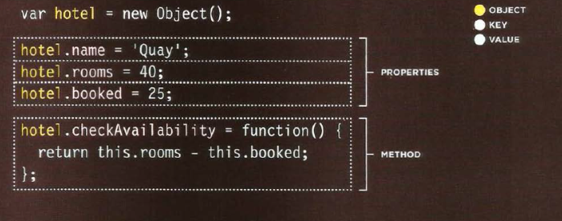
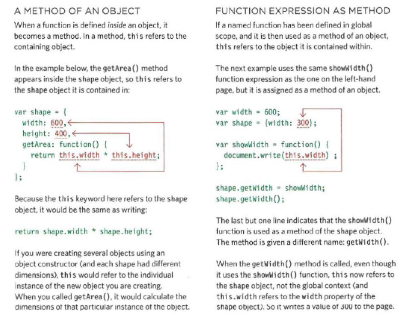

# From article: [Domain Modeling](#)

# HTML

## Tables <sup>1</sup>

* `<table>` element used to add tables to web page
* tables drawn row by row, each created with `<tr>` element
* cells are inside of rows, represented by `<td>` (or `<th> if in a header)
* you can make cells of a table span more than one row or column using the `rowspan` and `colspan` attributes
* for long tables you can split the table into a `<thead>`, `<tbody>`, and `<tfoot>`

# JavaScript

## Functions, Methods, and Objects <sup>2</sup>

### Creating objects with constructor notation



### Updating an object

Use either dot notation or square brackets
```javascript
hotel.name = 'Park';

hotel['name'] = 'Park';
```

To delete a property use the `delete` keyword

```javascript
delete hotel.name;

hotel.name = '';
```

### Keyword `this`



### Arrays are objects

They store data like objects, are just accessed differently, using indexes

Can have arrays of objects

```js
let thing = [
{1: a, 2:b, 3:c},
{lorem: ipsum, lorem:ipsum, lorem:ipsum}
]
```

And can also have objects of arrays

```js
let costs = {
room1: items[420, 40, 10],
room2: items[460, 20, 20],
room3: items[230, 0, 0]
}
```

### Three groups of built-in objects

* Browser object model - model of browser tab or window
* Document object model - creates model of current webpage
* Global javascript objects - group of individual objects that relate to different parts of the JS language
  * `String`
  * `Number`
  * `Boolean`
  * `Date`
  * `Math`
  * `Regex`

#### Footnotes

<sup>1</sup>Duckett, J. (2011). "HTML & CSS: design and build websites". Chapter 6. Wiley.

<sup>2</sup>Duckett, J. (2011). "JavaScript & JQuery: interactive front-end web development". Chapter 3. Wiley.

[Back](/reading-notes/201/201-TOC.html)