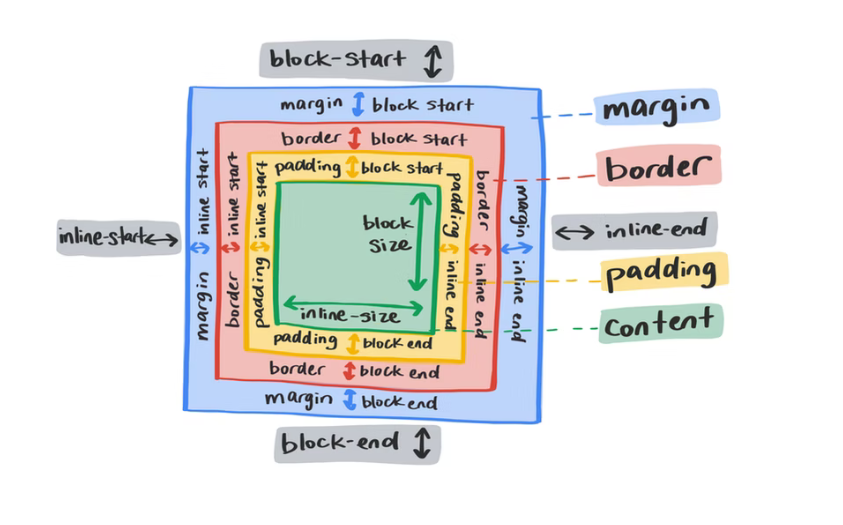
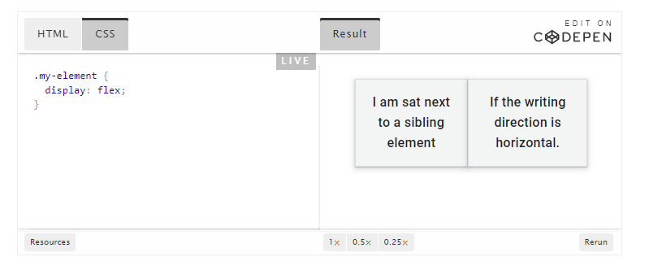
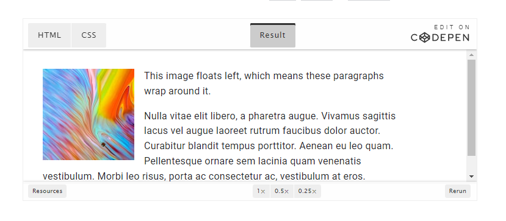

# CSS

## From article: '[Layout](https://web.dev/learn/css/layout/)'



* `display` property does two things: 1) determine if box it is applied to acts as inline or block, 2) determines how an element's children should behave (i.e. setting `display` to `display: flex` makes the box a block-level box, and also converts its children to flex items)

* Flexbox: layout mechanism for one-dimensional layouts.



* Grid: similar to flexbox, but designed to control multi-axis layouts instead of single-axis layouts. Adds `repeat()` and `minmax()` functions.
  * `fr` - unit: fraction of remaining space

`inline-block` - gives a box that has some characteristics of a block-level element, but flows inline with text

`float` - instructs an element to 'float' to direction specified, usually an image.



* Multicolumn layout - divides lists into columns

```css
  column-count: 2;
  column-gap: 1em;
  ```

* Positioning - `position` property changes how an element behaves in the normal flow of the document, and how it relates to other elements. `position` can be `relative`, `absolute`, `fixed`, and `sticky`; default value is `static`.

## Layout <sup>1</sup>

### Building Blocks

CSS treats each HTML element as if it's in its own box, which will either be block-level or inline


* If one block-level element sits inside another block-level element then the outer box is known as the *containing* or *parent* element


### Controlling position of elements

CSS has **positioning schemes** that allow for control of page layout: normal flow, relative postioning, and absolute positioning. Done with `position` property in CSS. Can also *float* elements with `float` property.


*Box offset* may need to be used to tell browser how far from top, bottom, left, or right of page a box should be placed.

### Footnotes

<sup>1</sup>Duckett, J. (2011). "HTML & CSS: design and build websites". Chapter 15. Wiley.

[Back](/reading-notes/201/201-TOC.html)