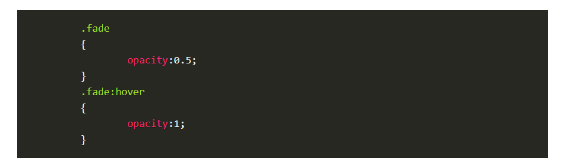
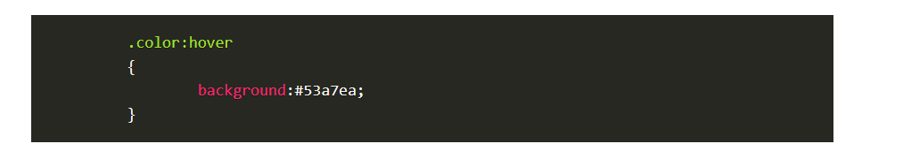
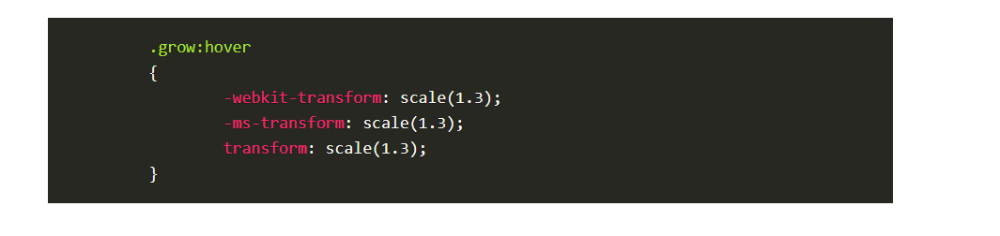
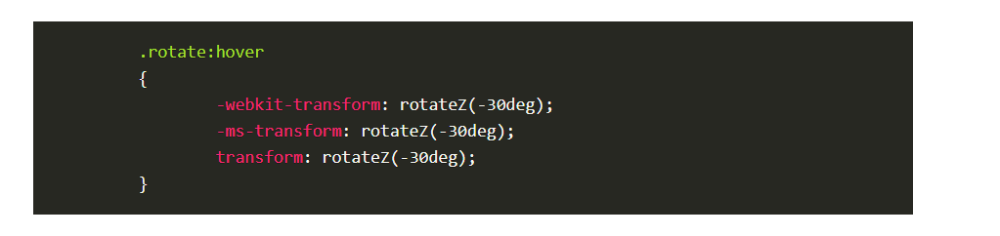
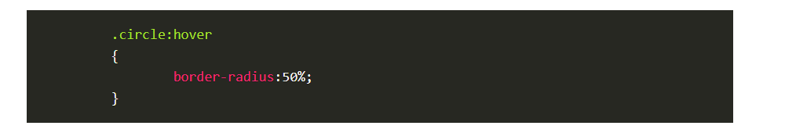
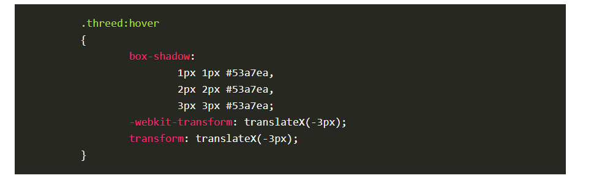
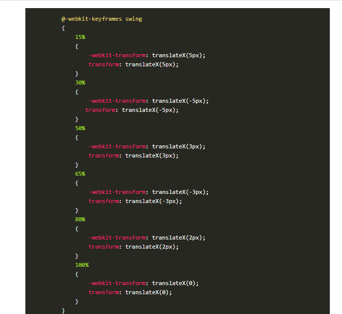
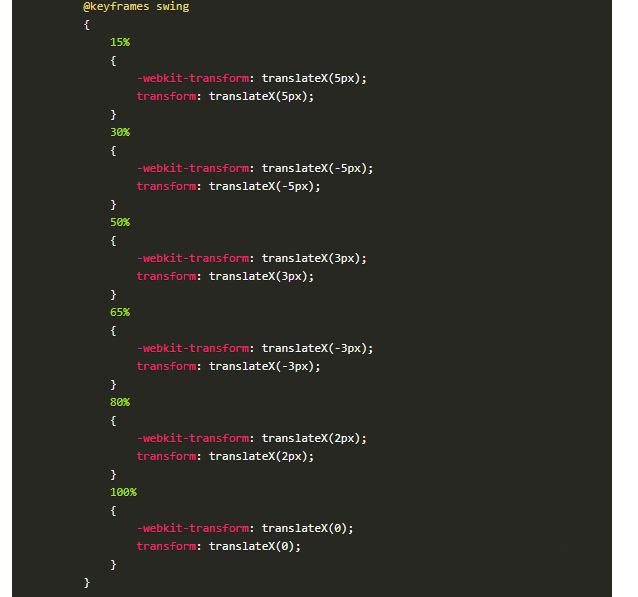
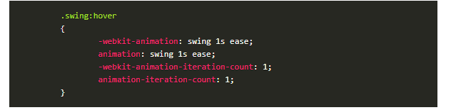
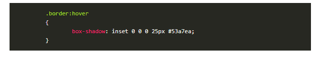

# Read 14

## What Google learned about teams 1

* Two attributes of the best teams
  * Members listen to one another
  * Members show sensitivity to feelings and needs

## CSS

### Transforms 2

* `transform` property
  * 2d
    * rotate, scale, multiple scaling, translate, skew, combinations, cube, more
  * 3d
    * rotate, scale, translate, skew, cube

### Transition & Animations 3

* Transitions provide a change from one state to another over multiple keyframes
  * color changes, shape changes
  * duration of change, delay until change occurs, timing of change

* Animations
  * like transitions but happening at multiple points (i.e. across the screen, up and down the screen)
  * also like transitions, have color/shape changes, timing of changes, delays until changes occur, duration of changes

### Example transitions 4

#### Fade in

#### Change Color

#### Grow/Shrink

#### Rotate elements

#### Square to circle

#### 3D Shadow

#### Swing

#### Inset border

### Footnotes

1https://www.nytimes.com/2016/02/28/magazine/what-google-learned-from-its-quest-to-build-the-perfect-team.html

2https://learn.shayhowe.com/advanced-html-css/css-transforms/

3https://learn.shayhowe.com/advanced-html-css/transitions-animations/

4https://www.webdesignerdepot.com/2014/05/8-simple-css3-transitions-that-will-wow-your-users

[Back](/reading-notes/201/201-TOC.html)