# Pre-work

## SQL Databases

### SQL Practice1

SQL databases seem a lot more flexible and easy to work with than NoSQLs.  You can narrow down search results to certain columns and rows, you can add and delete data, and you can add whole new tables or completely remove tables.  

#### Screenshots of completed SQLBolt tasks

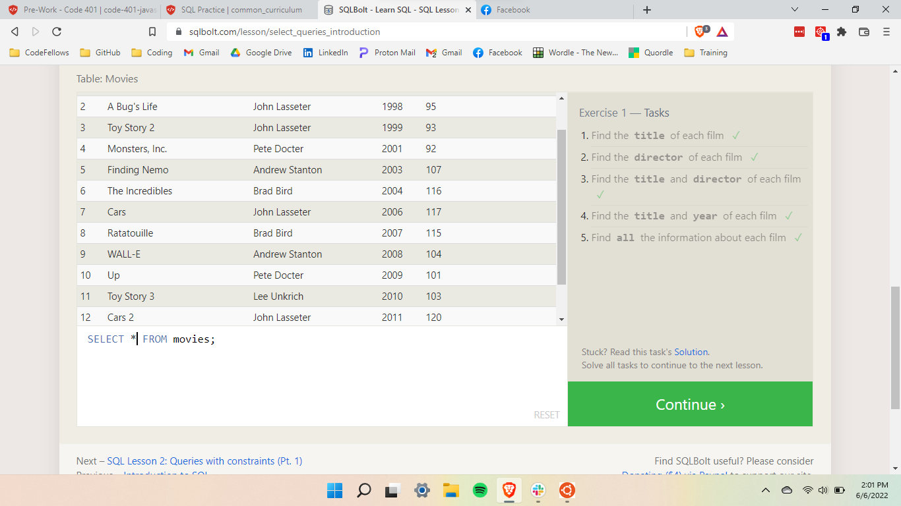
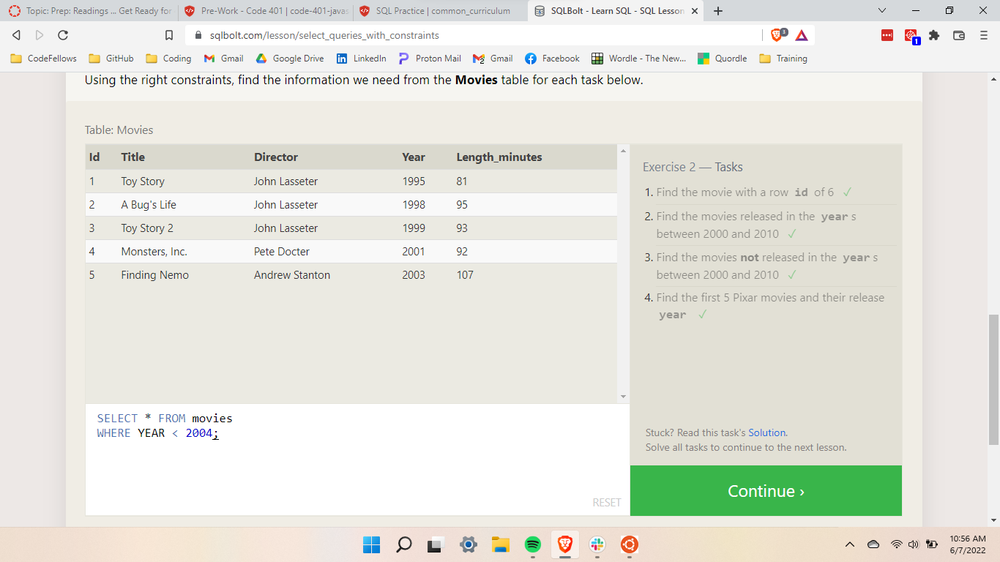
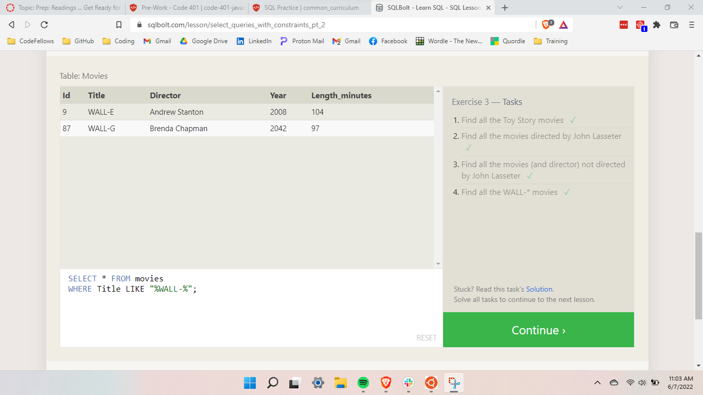
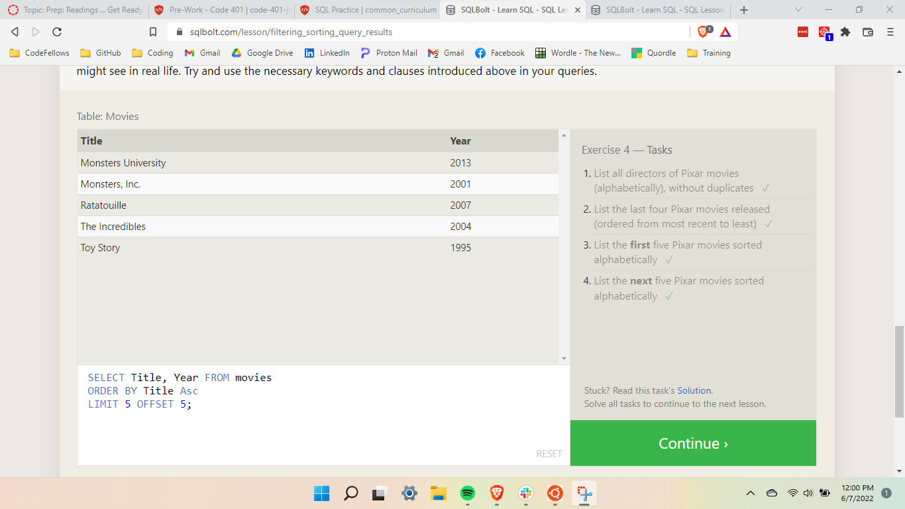
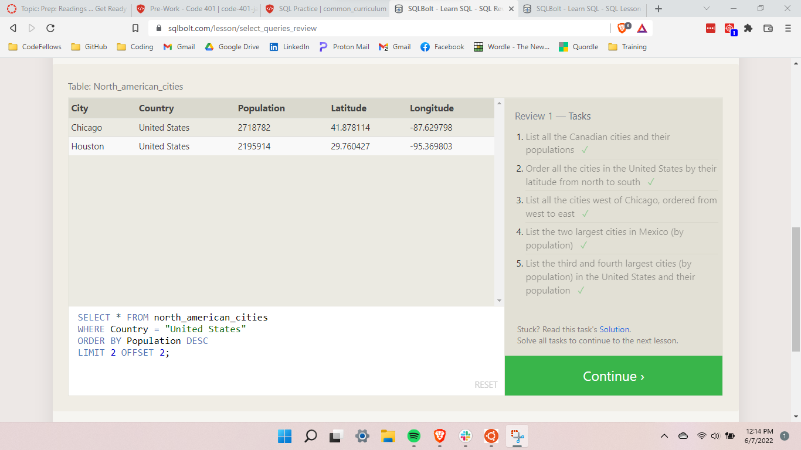
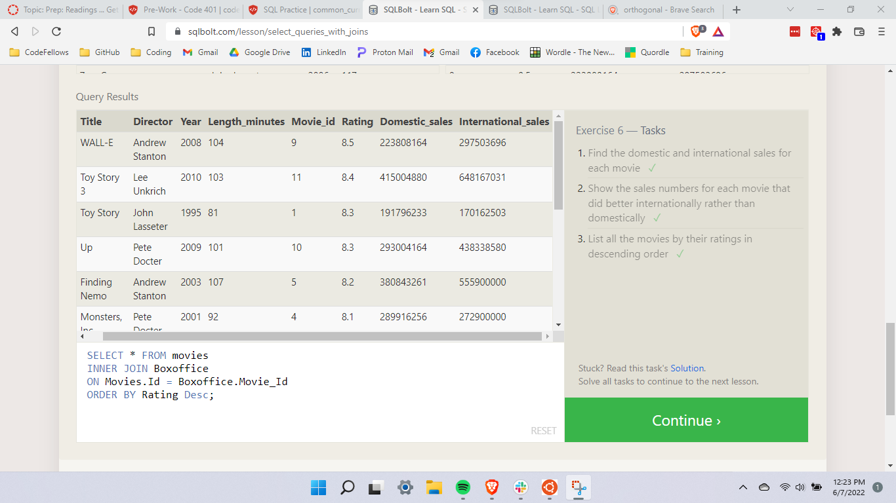
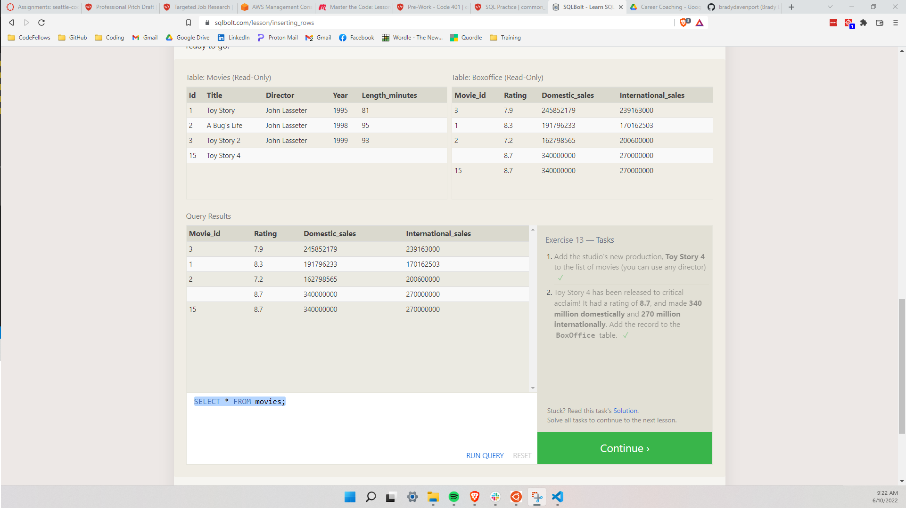
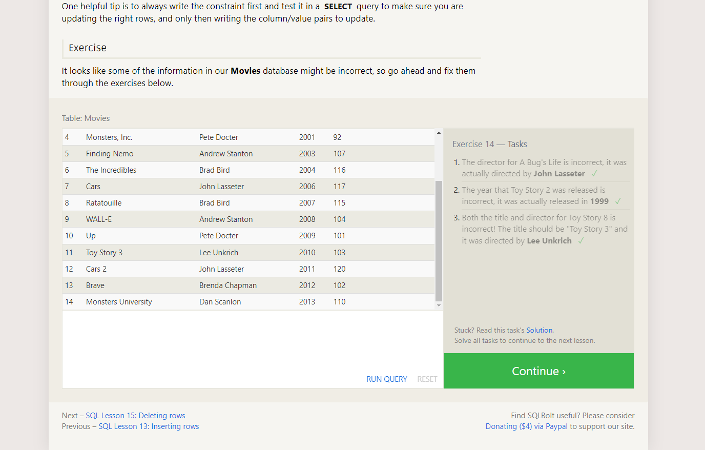
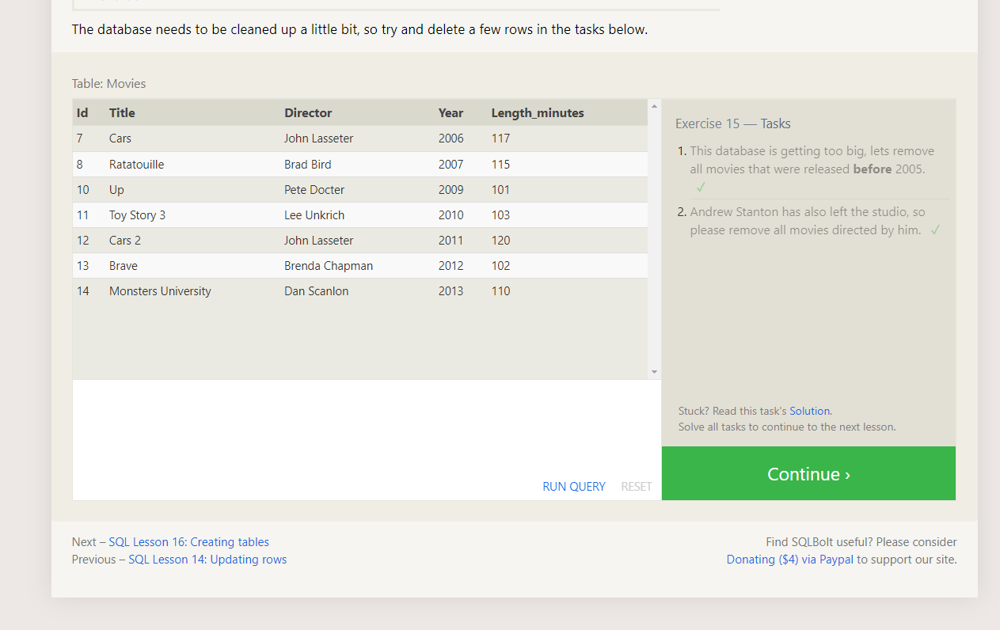
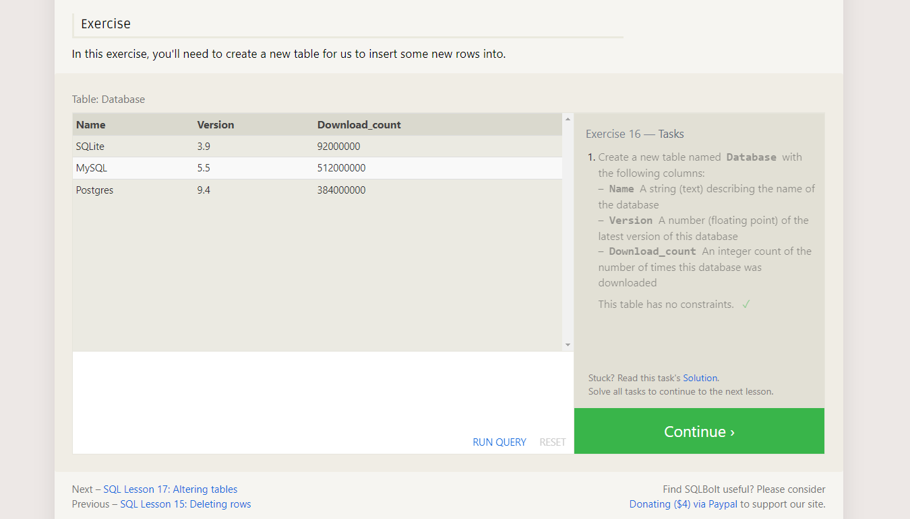
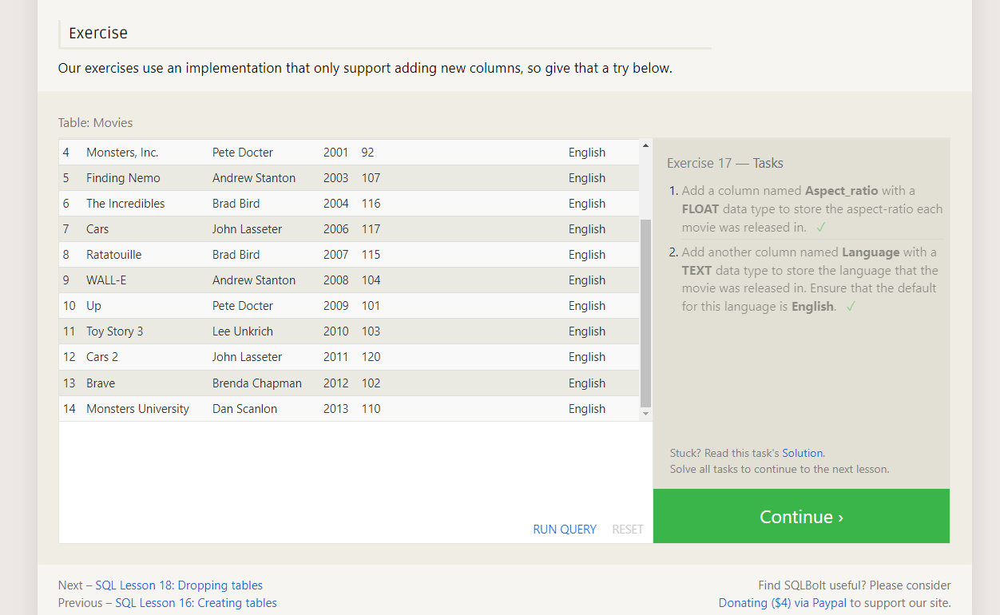
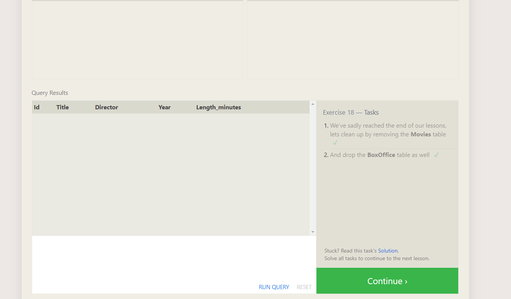

### Footnotes

1https://sqlbolt.com/