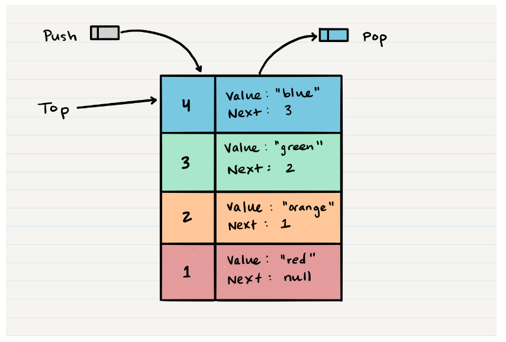
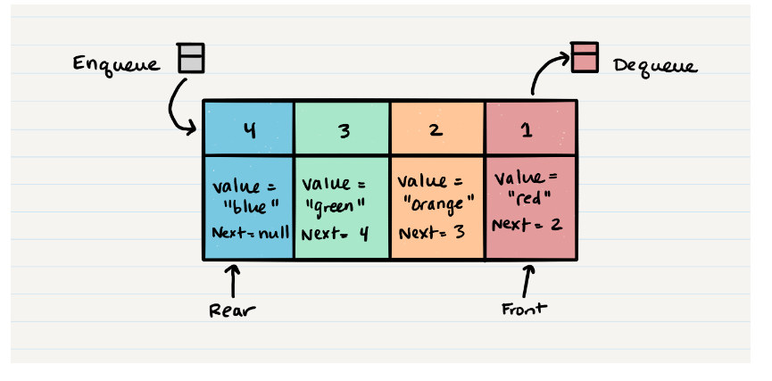

# Read 10

## Stacks and Queues

### Stacks and Queues1

#### What is a stack

A stack is a data structure that consists of `Nodes`.  Each `Node` references the next Node in the stack, but does not reference its previous.

* Common terms
  * Push - like `array.push()`, adds a node or item to the stack - *always an O(1) operation*
  * Pop - like `array.pop()`, removes a node or item from the stack - *always an O(1) operation*
  * Top - top of the stack
  * Peek - view the top of the stack - *always an O(1) operation*
  * IsEmpty - returns true when the stack is empty, otherwise false - *always an O(1) operation*

* FILO - First In Last Out
* LIFO - Last In First Out

#### What is a queue

* Common terms
  * Enqueue - Nodes or items that are added to the queue - *always an O(1) operation*
  * Dequeue - Nodes or items that are removed from the queue. If called when the queue is empty an exception will be raised - *always an O(1) operation*
  * Front - This is the front/first Node of the queue.
  * Rear - This is the rear/last Node of the queue.
  * Peek - When you `peek` you will view the value of the `front` Node in the queue. If called when the queue is empty an exception will be raised - *always an O(1) operation*
  * IsEmpty - returns true when queue is empty otherwise returns false - *always an O(1) operation*

* FIFO - First In First Out
* LILO - Last In Last Out

### Footnotes

1https://codefellows.github.io/common_curriculum/data_structures_and_algorithms/Code_401/class-10/resources/stacks_and_queues.html

[Back](/reading-notes/401/401-TOC.html)