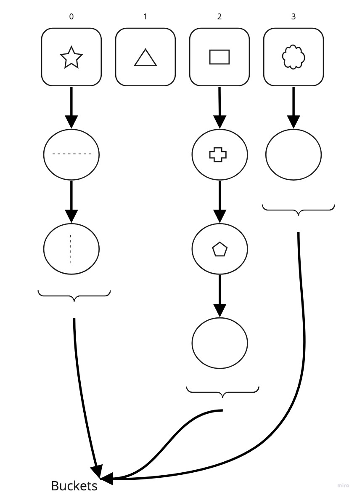

# Read 30

## Hash Tables

- Hash: A hash is the result of some algorithm taking an incoming string and converting it into a value that could be used for either security or some other purpose. In the case of a hashtable, it is used to determine the index of the array.

- Buckets: A bucket is what is contained in each index of the array of the hashtable. Each index is a bucket. An index could potentially contain multiple key/value pairs if a collision occurs.

- Collisions:  A collision is what happens when more than one key gets hashed to the same location of the hashtable.

- Uses for hash tables
  - Holding unique values
  - dictionary
  - library

- What is a hash table?
  - a data structure that utilizes key value pairs - every `Node` or `Bucket` has both a key and a value

- Hashing: essentially like encrypting

- Internal Methods
  - Add() - adds a new key/value pair to a hashtable
  - Find() - locates specified index position, iterates through bucket to see if key exists, returns value
  - Contains() - returns a boolean on if input key exists in table
  - GetHash() - accepts a key as a string, conducts hash, returns index of array where key/value should be placed

### Footnotes

1https://codefellows.github.io/common_curriculum/data_structures_and_algorithms/Code_401/class-30/resources/Hashtables.html

2https://www.youtube.com/watch?v=MfhjkfocRR0

3https://www.hackerearth.com/practice/data-structures/hash-tables/basics-of-hash-tables/tutorial/

4https://en.wikipedia.org/wiki/Hash_table

[Back](/reading-notes/401/401-TOC.html)