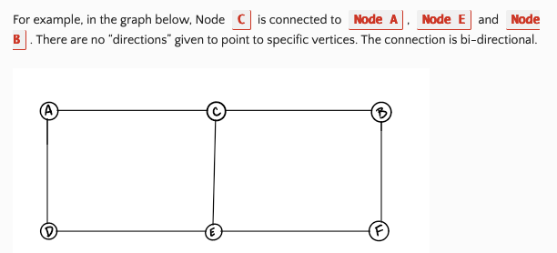
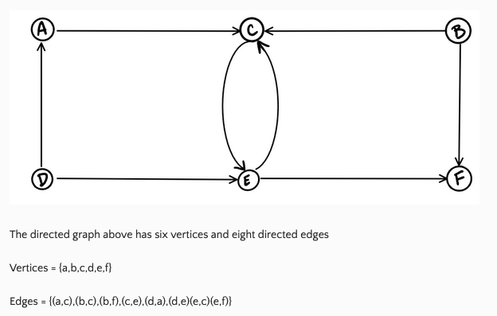
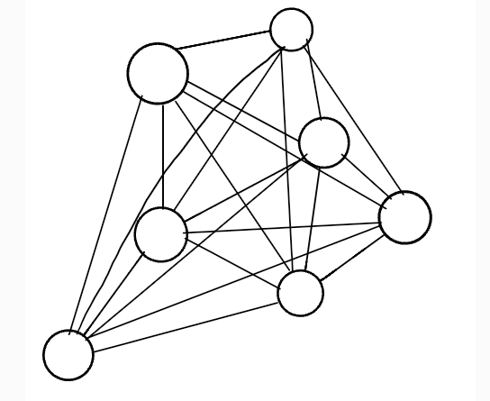
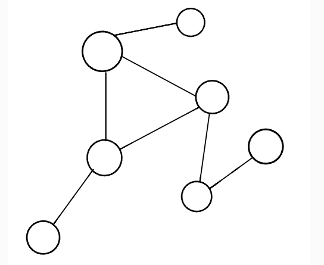
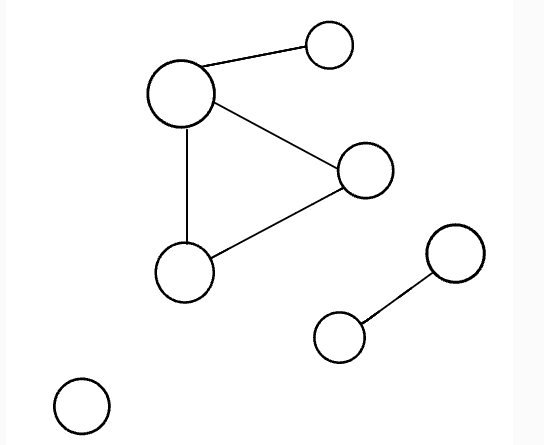

# Read 35

## Graphs

### Graphs1

- **Graph**: a non-linear data structure that can be looked at as a collection of `vertices` (or `nodes`) potentially connected by line segments named `edges`

- Common terms
  - **Vertex**:  A vertex, also called a “node”, is a data object that can have zero or more adjacent vertices.
  - **Edge**: An edge is a connection between two nodes.
  - **Neighbor**: The neighbors of a node are its adjacent nodes, i.e., are connected via an edge.
  - **Degree**: The degree of a vertex is the number of edges connected to that vertex.

- Directed vs Undirected
  - **Directed**: where each edge is undirected or bi-directional, meaning the undirected graph does not move in any direction

  - **Directed**: also called `Digraph`, every edge is directed (`node.next`)

- Complete vs Connected vs Disconnected
  - **Complete**: all `vertices`/`nodes` are connected to other `vertices`/`nodes`

  - **Connected**: all `vertices`/`nodes` have at least one edge
    - a `Tree` is a form of a connected graph

  - **Disconnected**: some `vertices`/`nodes` may not have edges

- Acyclic vs cyclic
  - **Acyclic**: a graph without cycles
  - **Cyclic**: a node can be traversed through and potentially end up back at itself

- Graph representation
  - **Adjacency matrix**: 2-dimensional array
    - if *n* vertices, then *n x n* Boolean matrix
    - each row/column represents each vertex of the graph
  - **Adjacency list**: \* most common way to represent graphs \*
    - collection of linked lists or an array

- **Weighted Graphs**
  - a graph with numbers assigned to its edges
    - the numbers are called the **weights**
    - can be used to set up an adjacency list with key/value pairs

- Traversals
  - **Breadth first**: visit all nodes that are closest to the root as possible, then traverse outwards, level-by-level
    - uses a `Queue`
  - **Depth first**: visit all children of a given subtree, then move to other subtrees
    - uses a `Stack`

- **Real world use of graphs**
  - GPS, mapping
  - Driving directions
  - Social networks
  - Airline traffic
  - Netflix uses graphs for suggestions of products

### Footnotes

1https://codefellows.github.io/common_curriculum/data_structures_and_algorithms/Code_401/class-35/resources/graphs.html

[Back](/reading-notes/401/401-TOC.html)